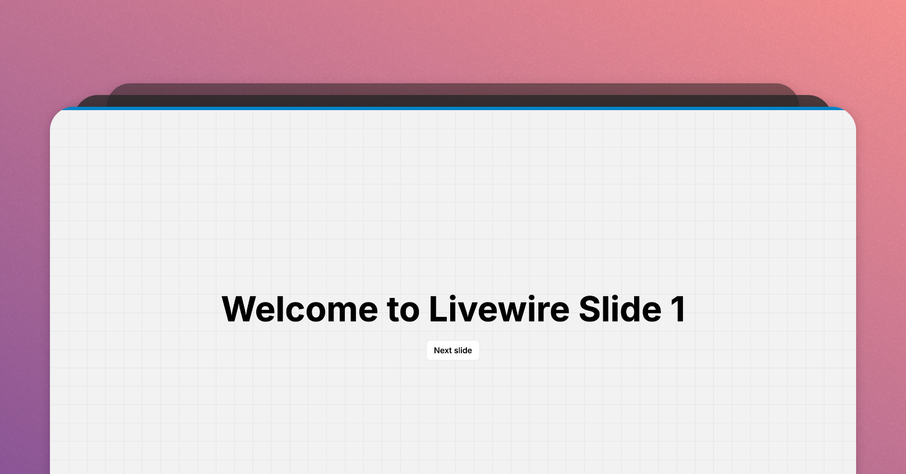

# Laravel Livewire Slides

An interactive slides presentation project built with Laravel Livewire, inspired by Caleb Porzio's talk at LaraconUS 2024.

Check out the talk here: [Caleb Porzio's LaraconUS 2024 Talk](https://www.youtube.com/watch?v=31pBMi0UdYE)

## 🚀 Quick Start

Add slide files to the `app/Livewire/slides` directory. Each slide is a PHP file that returns an HTML string. You can also use Blade components or Livewire components, just like when you are working in a Blade file.

Example:

```php
<?php

return <<<'HTML'
<div class="text-center grid gap-4">
    <div class="text-6xl font-bold">
        Welcome to Livewire Slide 1
    </div>
    <x-button wire:click="next">
        Next slide
    </x-button>
</div>
HTML;
```

## Demo


